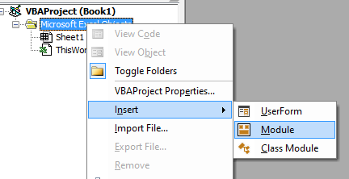

---
title: "Excel - VBA - Call a web service"
subtitle: "How to"
date: "22 juin 2020, 23:26"
keywords: []
language: "en"
---

<!-- This file has been generated by the concat-md.ps1 script. -->
<!-- Don't modify this file manually (you'll loose your changes) -->
<!-- but run the tool once more -->

<!-- Last refresh date: 2020-06-22 23:26:11 -->

<!-- below, content of ./index.md -->

<!-- markdownlint-disable MD025 -->

# Excel - VBA - Call a web service


> How to call a web service in Excel VBA. The example is built using the European Union's VIES CheckVAT web service.

<!-- table-of-contents - start -->
* [How to install](#how-to-install)
* [How to call](#how-to-call)
* [Source](#source)
  * [modWebService.bas](#modwebservicebas)
  * [checkVat.xml](#checkvatxml)
<!-- table-of-contents - end -->

## How to install

1. Create a new Excel workbook
2. Press <kbd>ALT</kbd>-<kbd>F11</kbd> to open the Visual Basic Editor
3. Create a new module

    

4. Copy/paste there the VBA code you can find below or in the [files/modWebService.bas](https://raw.githubusercontent.com/cavo789/vba_excel_call_webservice/master/files/modWebService.bas) file.
5. Take a look to the declaration of the `InputXmlFile` constant: update the path to any valid path on your system and create that file.
6. Open that file and copy/paste there the content of the [files/checkVat.xml](https://raw.githubusercontent.com/cavo789/vba_excel_call_webservice/master/files/checkVat.xml)

## How to call

Go in the Visual Basic Editor, put the cursor in the `run` subroutine and press <kbd>F5</kbd>. The code will retrieve the company behind the provided VAT number.

## Source

### modWebService.bas

```VBNet
Option Explicit

' URL to call
Const URL = "http://ec.europa.eu/taxation_customs/vies/services/checkVatService"

' XML to send to the web service method
Const InputXmlFile = "C:\temp\checkVat.xml"

' *************************************************************
'
' Entry point
'
'    - Call the web service checkVAT method
'    - Upload XML data (country and VAT number)
'    - Get XML response
'    - Open the response as a workbook
'
' *************************************************************
Sub run()

    Dim sData As String
    Dim sResponseFileName As String

    ' Get the input manifest
    sData = openCheckVatXml(InputXmlFile)

    ' Consume the web service and get a filename with the response
    If (sData = "") Then
        MsgBox "Failure, the " & InputXmlFile & " file didn't exists", vbExclamation + vbOKOnly
        Exit Sub
    End If

    sResponseFileName = consumeWebService(URL, sData)

    ' Open the response as a workbook
    Call Application.Workbooks.OpenXML(Filename:=sResponseFileName)

End Sub

' *************************************************************
'
' Open the checkVat.xml input and replace variables
'
' *************************************************************
Private Function openCheckVatXml(ByVal sFileName As String) As String

    Dim sData As String

    sData = readFile(sFileName)

    If (sData <> "") Then
        sData = Replace(sData, "%COUNTRY%", "BE")
        sData = Replace(sData, "%VATNUMBER%", "0403170701") ' ENGIE Electrabel Belgique
    End If

    openCheckVatXml = sData

End Function

' *************************************************************
'
' Generic file reader. Return the content of the text file
'
' *************************************************************
Private Function readFile(ByVal sFileName As String) As String

    Dim objFso As Object
    Dim objFile As Object
    Dim sContent As String

    Set objFso = CreateObject("Scripting.FileSystemObject")

    If Not (objFso.FileExists(sFileName)) Then
        ' The file didn't exists
        readFile = ""
        Exit Function
    End If

    Set objFile = objFso.OpenTextFile(sFileName, 1)

    sContent = objFile.readAll

    objFile.Close

    Set objFile = Nothing
    Set objFso = Nothing

    readFile = sContent

End Function

' *************************************************************
'
' Return a filename with the response of the web service method
'
' *************************************************************
Private Function consumeWebService(ByVal sURL As String, ByVal sData As String) As String

    Dim xmlhttp As Object
    Dim sResponseFileName As String

    Set xmlhttp = New MSXML2.ServerXMLHTTP60  ' Requires Microsoft XML, v6.0

    xmlhttp.Open "POST", sURL, True
    xmlhttp.send sData
    xmlhttp.waitForResponse

    sResponseFileName = createXmlTempFile(xmlhttp.responseText)

    Set xmlhttp = Nothing

    consumeWebService = sResponseFileName

End Function

' *************************************************************
'
' Create a temporary file in the TEMP folder and write in that
' file the XML response received by the web service.
'
' Return the temporary filename as result of this function
'
' *************************************************************
Private Function createXmlTempFile(ByVal sContent As String) As String

    Dim objFso As Object
    Dim objFile As Object
    Dim objFolder As Object
    Dim sFileName As String

    Set objFso = CreateObject("Scripting.FileSystemObject")

    ' 2 = temporary folder
    Set objFolder = objFso.GetSpecialFolder(2)
    sFileName = objFolder & "\"
    Set objFolder = Nothing

    sFileName = sFileName & objFso.GetTempName()
    sFileName = Replace(sFileName, ".tmp", ".xml")

    Set objFile = objFso.CreateTextFile(sFileName)

    objFile.Write sContent

    objFile.Close

    Set objFile = Nothing
    Set objFso = Nothing

    createXmlTempFile = sFileName

End Function
```

### checkVat.xml

```xml
<?xml version="1.0" encoding="utf-8"?>
<soapenv:Envelope xmlns:soapenv="http://schemas.xmlsoap.org/soap/envelope/">
    <soapenv:Body>
        <urn:checkVat xmlns:urn="urn:ec.europa.eu:taxud:vies:services:checkVat:types">
            <urn:countryCode>%COUNTRY%</urn:countryCode>
            <urn:vatNumber>%VATNUMBER%</urn:vatNumber>
        </urn:checkVat>
    </soapenv:Body>
</soapenv:Envelope>
```
